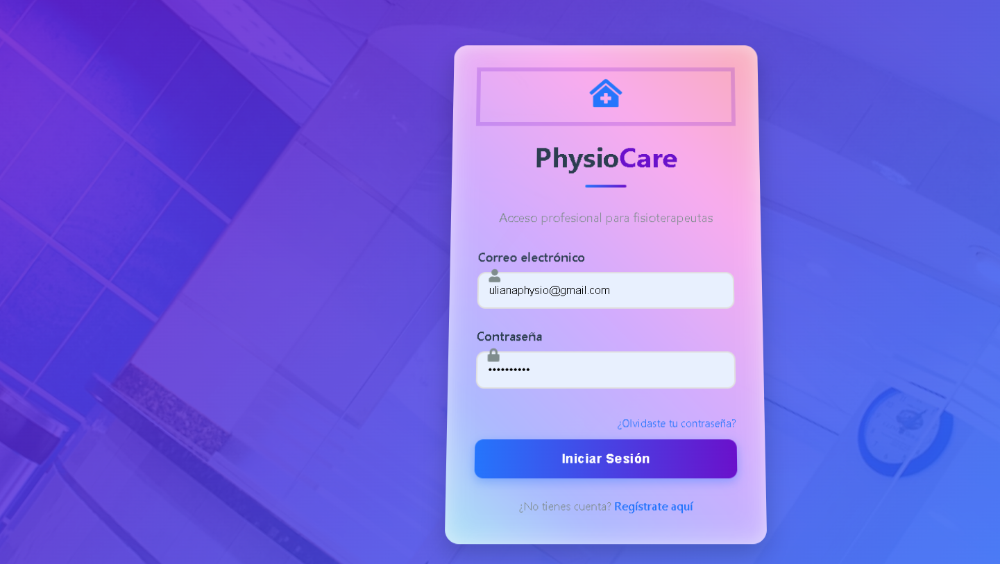
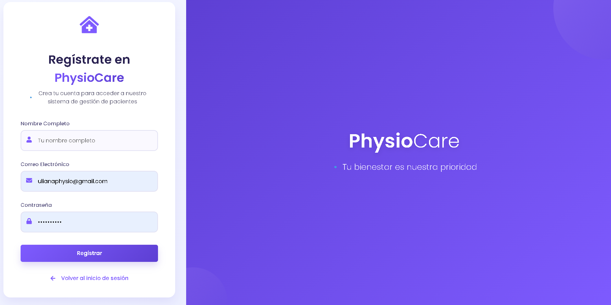
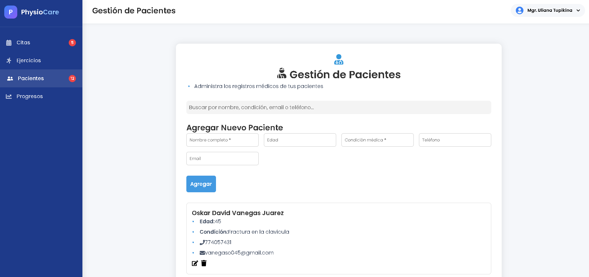
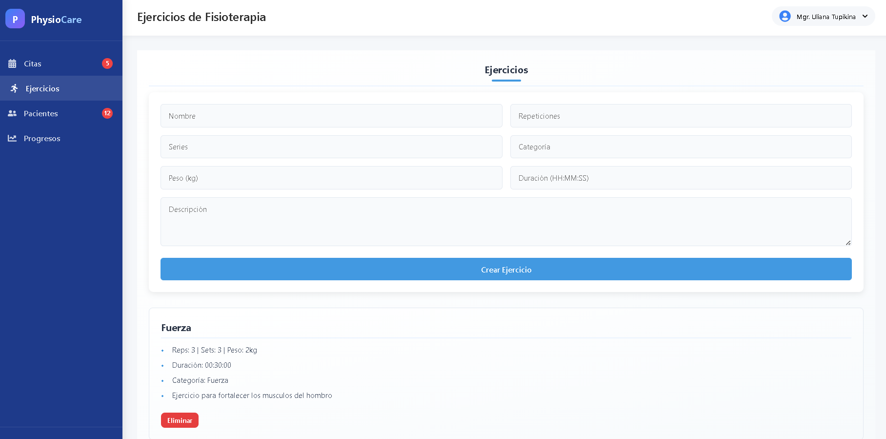
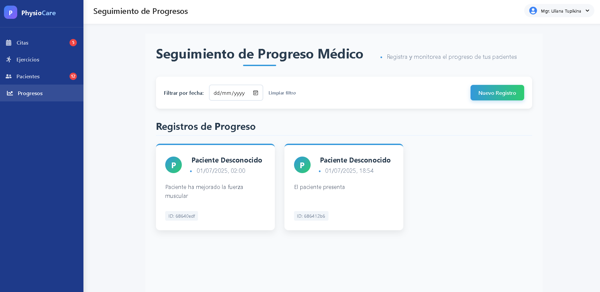
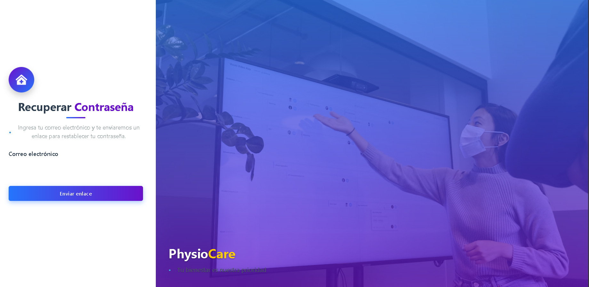

# 🏥 Physiotherapy App - Frontend

This is the frontend of a physiotherapy management web application. It allows therapists to register patients, schedule appointments, and assign personalized exercise routines.

## 🚀 Technologies Used

- ⚛️ React
- 💅 Custom CSS & Tailwind CSS
- 📦 Axios (HTTP requests)
- 🧭 React Router DOM
- 🌐 REST API backend (Node.js + Express)

## 🎯 Key Features

- Register, update, and delete patients
- View and manage scheduled appointments
- Assign and track physical exercises
- Responsive, mobile-friendly interface
- Real-time communication with backend API

## 📸 Screenshots

### 🔐 Login Page


### 👤 Register Page


### 🧑‍🤝‍🧑 Patients List


### 🏋️ Exercises


### 📈 Progress Tracking


### ❓ Forgot Password



## 🛠️ Getting Started Locally

### Prerequisites

- Node.js (v16 or newer)
- Backend API running and accessible

### Installation

```bash
# Clone the repository
git clone https://github.com/vanos0600/physiotherapy-frontend.git

# Go into the directory
cd physiotherapy-frontend

# Install dependencies
npm install

# Start the development server
npm run dev

Project Structure
bash
Copy
Edit
physiotherapy-frontend/
├── public/
├── src/
│   ├── components/
│   ├── pages/
│   ├── services/
│   └── App.jsx
├── screenshots/
├── README.md
└── package.json

Contact
Made with ❤️ by Oskar Vanegas
GitHub: @vanos0600


